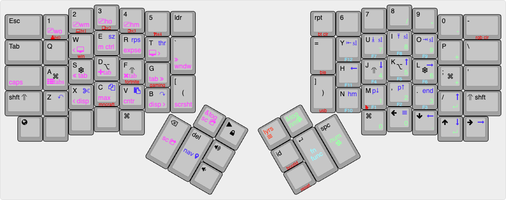

# DivisionSt layout

## Oryx with custom QMK

This repository allows combining the convenience of [Oryx’s](https://www.zsa.io/oryx) graphical layout editing with the power of [QMK](https://qmk.fm), allowing you to customize your Oryx layout with advanced QMK features like Achordion and Repeat Key, while automating firmware builds through GitHub Actions.

For a detailed guide, check out the full [blog post here](https://blog.zsa.io/oryx-custom-qmk-features).

## ZMK Firmware (SliceMK Ergodox Wireless)

This repository now also contains a ZMK configuration under `config` converted from the original QMK layout, kept in parity with the QMK config.
